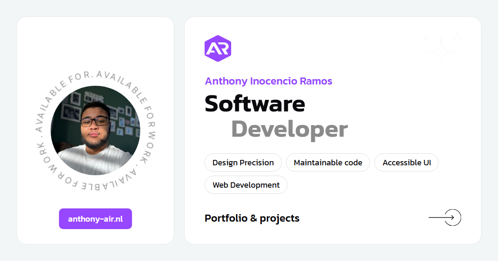

<div align="center">

# Anthony Inocencio Ramos: Portfolio

**My personal portfolio: projects, case studies and services, in English and Dutch.**

[🌐 Live site](https://anthony-air.nl) · [💼 Projects](https://anthony-air.nl/projects) · [👤 GitHub profile](https://github.com/Anthony-AIR-03)


<a href="https://anthony-air.nl"></a>

</div>

## About

A bento-style portfolio built with Vue 3 and TypeScript. It shows my projects with screenshots,
live-demo notes and long-form case studies, the services I offer, and a contact form. Every piece of
text is available in English and Dutch, switchable at runtime.

- **Projects:** each project has its own detail page with a screenshot gallery, tech tags and links;
  larger projects (like [Telumera](https://github.com/Anthony-AIR-03/telumera)) get a custom page
  with per-module case studies written in Markdown.
- **Bilingual:** all UI text lives in `src/languages/en.json` and `nl.json`; project content is stored
  per language in the project data. The chosen language is remembered in a session cookie.
- **Search-engine ready:** per-page titles, descriptions and canonical URLs, structured data
  (schema.org), Open Graph link previews, and a sitemap generated at build time from the project
  data.
- **Calm motion:** seamless marquees that pause on hover and stop entirely for visitors who prefer
  *reduced motion*.
- **Contact form:** sends mail through [EmailJS](https://www.emailjs.com/), so no backend is needed.
- **Privacy-friendly analytics:** page views are measured with my own self-hosted platform,
  [Telumera](https://telumera.nl).

## Getting started

Requirements: Node.js 20 or newer.

```bash
npm ci
cp env.example .env   # fill in your EmailJS IDs to make the contact form work
npm run dev           # http://localhost:5173
```

| Command | What it does |
|---|---|
| `npm run dev` | Start the Vite dev server with hot reload |
| `npm run build` | Type-check with `vue-tsc` and build to `dist/` (also emits `sitemap.xml`) |
| `npm run preview` | Serve the production build locally |

## Project structure

```
src/
├─ assets/
│  ├─ data/           # projectsData.ts (all projects), personalData.ts, navbarData.ts
│  ├─ case-studies/   # long-form case studies, one Markdown file per language
│  ├─ image/          # screenshots and illustrations
│  └─ styles/         # SCSS, split per page and shared partials
├─ components/
│  ├─ pages/          # page-specific components (home, about, projects, services, contact)
│  └─ shared/         # navbar, footer, Marquee, buttons, theme and language switcher
├─ languages/         # en.json, nl.json and the vue-i18n setup
├─ pages/             # one component per route
└─ router/            # routes; each route's meta.title is an i18n key
```

### Adding a project

1. Add screenshots to `src/assets/image/`.
2. Add an entry to `projectsData` in `src/assets/data/projectsData.ts` with an English and Dutch
   title and descriptions. Set `featured: true` for a double-width card.
3. That's it: the projects grid, detail page, previous/next pager and sitemap all pick it up.

## Deployment

Every push to `main` is built and deployed automatically with GitHub Actions. The EmailJS keys are
provided to the build as repository secrets, never committed.

## Credits

The original layout was based on the *Bentox* portfolio template and has since been rebuilt and
extended: projects, case studies, translations, SEO and accessibility work are my own.

---

<div align="center">

Made by **Anthony Inocencio Ramos** · [anthony-air.nl](https://anthony-air.nl) · [LinkedIn](https://www.linkedin.com/in/anthony-inoc%C3%AAncio-ramos-b89003277/)

</div>
